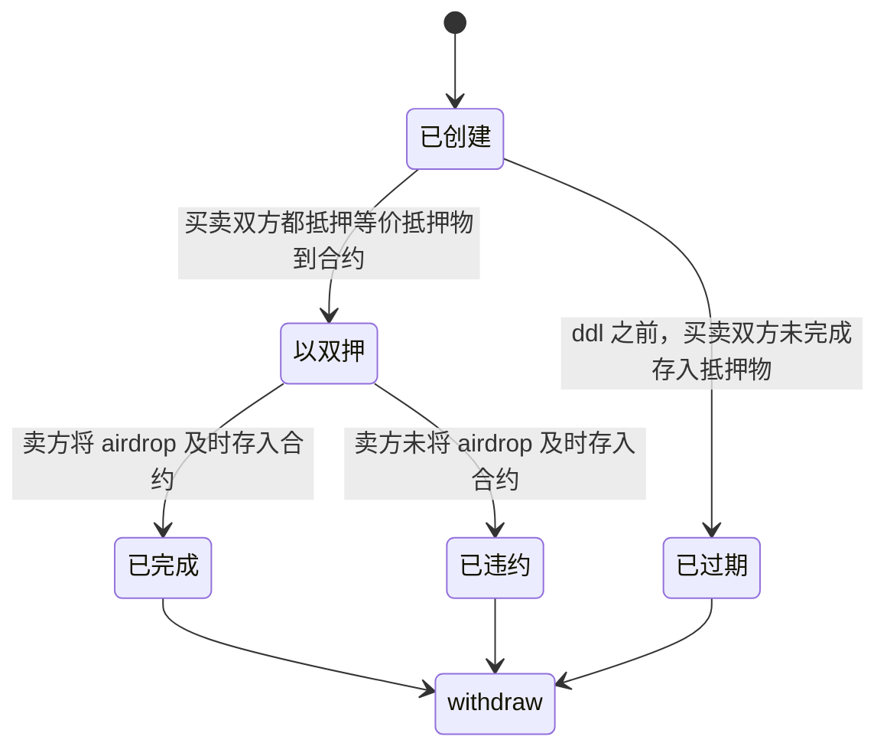

# AirdropSeller

## 用途
使用双押模式，在链上安全，透明的交易 airdrop token，本 repo 专门为交易 $ARB 使用，但是合约应该是可以复用于其他 airdrop token 的交易

## 双押模式
一个顺利完成的流程如下：
1. 买卖双方，寻找可信中间人(中间人进行一定比例的抽成)
2. 约定交易的单价，总量, 假设总价值为 $T
3. 买卖双方都将价值 $T 的抵押品抵押至中间人处
4. 到了空投发放日期以后，卖方将 airdrop token 转账至中间人
5. 中间人将 airdrop token 转给买方，同时将卖方的抵押物和买方的抵押物均转移给卖方

如果上述流程中，买卖双方任一方反悔，抵押的金额都会由赔付给对手，这样做也降低了毁约的可能性.
上述流程最大的问题在于如何找到一个真正可信的中间人，而智能合约其实就是为此而生，作为 web3 从业者，实在没有理由选择找线下中间人这种方案。所以简单写了一个合约 demo 来演示如何使用智能合约来完成这种双押交易.

对应状态机如下:


## 使用
1. 买卖双方均下载此 repo, 安装环境
```shell
git clone git@github.com:neal-zhu/airdrop-seller.git
cd airdrop-seller
npm i
```
2. 买卖双方约定好价格，总量，交易的 ddl, 并按照约定好的内容，配置 .env 文件
3. 部署合约(可以由任意人部署)
```shell
npx hardhat run scripts/deploy.js
// output:
// AirdropSeller deployed to: 0x7A9Ec1d04904907De0ED7b6839CcdD59c3716AC9
// deposit token: USDT amount: 1200
// airdrop token: ARB amount: 1000
// ddlTime 2023-03-24T00:41:25.000Z
```
4. 通知买卖双方合约地址，双方务必对合约进行校验(开源合约), 使用下面的命令可以获取合约相关信息
```shell
npx hardhat detail --contract $CONTRACT
```
5. 确认无误后，买方先执行
```shell
npx hardhat buyer_deposit --contract $CONTRACT
```
6. 卖方执行
```shell
npx hardhat seller_deposit --contract $CONTRACT
```
7. airdrop 可以领取后（务必在 ddl 过期之前！）, 如果卖方自己执行了 claim 操作，那么执行
```shell
npx hardhat seller_deposit_airdrop --contract $CONTRACT
```
如果用户没有执行过 claim，可以直接用
```shell
npx hardhat seller_claim_deposit_airdrop --contract $CONTRACT # 脚本负责 claim ARB
```
8. 至此交易顺利完成，买卖双方可以在任意时间，执行
```shell
npx hardhat buyer_withraw --contract $CONTRACT  # 买方取回 airdrop token
npx hardhat seller_withraw --contract $CONTRACT # 卖方收回自己的押金和买方的钱
```
